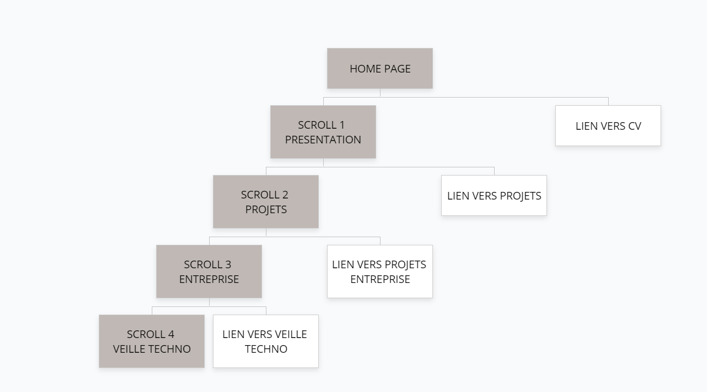

# projet
portfolio [home page](https://laetitiamichel.github.io/projet/)

Gloomaps 

## PRESENTATION

## CHARTE GRAPHIQUE

## CHARTE TYPO

### images SVG
J'ai créé mes propres icones sur FAVICO.IO

Puis je les ai converti en SVG

et ensuite j'ai modifié le fichier source pour retirer les couleurs de contours:

// pour convertir la première ligne du site manifest en JSON => converteur json
  // copier coller le code
  // pour vérifier que le json fonctionne => inspecter dans chrome puis
  // application => dossier manifest
